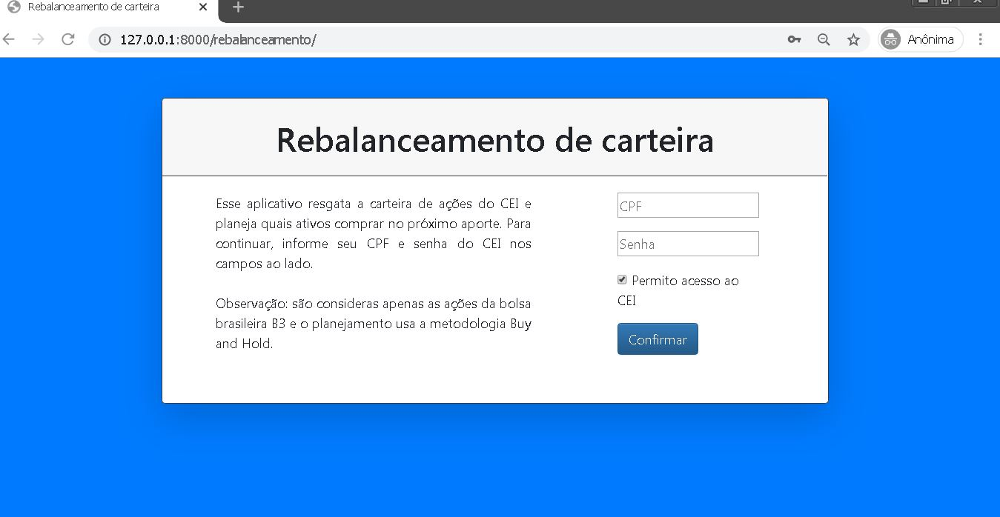
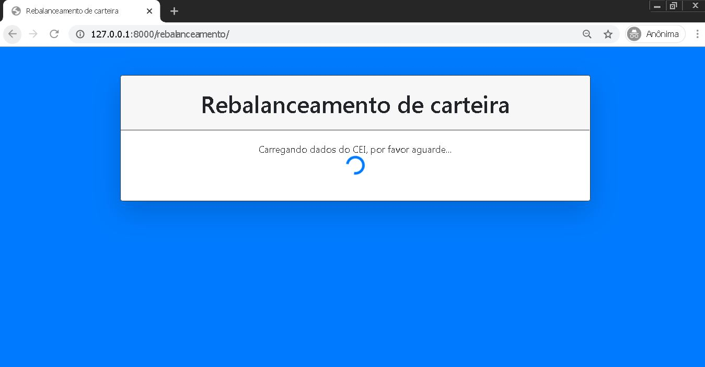

# rebalanceamento_acoes
Servidor Django para uma aplicação que planeja o rebalanceamento e o investimento de um novo aporte em uma carteira de ações da bolsa brasileira (B3). A estratégia de rebalanceamento é a de "comprar o ativo mais atrasado" e a de investimento é a Buy and Hold.

Essa aplicação se mostra bastante útil para adpetos da filosofia Buy and Hold pois:
1. automatiza o planejamento dos aportes (sejam eles anuais, mensais ou semanais)
2. esconde os preços dos ativos
3. mostra de forma detalhada o desbalanceamento da carteira

## Descrição detalhada
A aplicação faz um Web Crawling com o navegador Chrome (em modo headless) para coletar a carteira do usuário pelo CEI (Canal Eletrônico do Investidor). 
Para limitar o uso de memória RAM, um único navegador é aberto e uma fila foi implementada para atender possíveis requisições em paralelo.

O processamento dura em torno de 30 segundos e uma tela de carregamento foi adicionada para conscientizar o usuário.

Assim que a coleta da carteira é confirmada, o usuário é redirecionado para uma tela onde é possível estabelecer as porcentagens alvo de cada ativo e o valor do aporte.

A tela final é exibida após a inserção desses dados. O planejamento é feito e uma tabela com os ativos para comprar é gerada, junto com os seguintes gráficos:
* Fator de desbalanceamento: compara um índice de desbalanceamento (soma das diferenças da % atual do ativo e a % alvo) antes e depois do planejamento
* Balanceamento de ativos: mostra o balanceamento antes e depois do planejamento
* Alocação de capital: mostra qual percentual do aporte foi possível alocar

#### Rebalanceamento
O rebalanceamento prioriza:
1. o maior atraso em relação à porcentagem automaticamente definida (100/número de ações), aplicada sobre o total da carteira (desconsiderando aporte) 
2. maior cotação

Para cada ativo, o script tenta atingir essa porcentagem (caso esteja atrasado) ou pelo menos comprar 1 ativo.

#### Investimento
O investimento é feito com o restante do aporte, após um rebalanceamento que concluído com sucesso (compra de todos os ativos atrasados).
Nele, apenas a maior cotação é utilizada como meio de ordenação e a porcentagem é aplicada apenas no restante do aporte.
Similar ao rebalanceamento, o objetivo é comprar pelo menos 1 ação de cada ativo.

## Requerimentos:
* Navegador Chrome 
* (Linux) substituir o chromedriver do windows por uma versão compatível com linux na pasta "rebalanceamento"

## Bibliotecas utilizadas: 
* Bokeh (visualização de gráficos sobre a carteira)
* Pandas e Numpy (manipulação de dados) 
* Selenium (Web Crawling para adquirir informações do CEI e dos preços dos ativos)

## Testes
Para executar os testes, é necessário criar um arquivo na pasta "rebalanceamento" chamado "login_info.py" com duas variáveis: "cpf" e "password", que devem conter uma senha e um cpf válidos para teste do Web Crawling do CEI.

## Telas do Front-end
* Formulário de login CEI

* Carregamento 

* Confirmação de ativos

* Tabela de recomendações

* Gráfico de balanceamento de ativos

* Gráfico de fator de desbalanceamento

* Gráfico de alocação do capital

